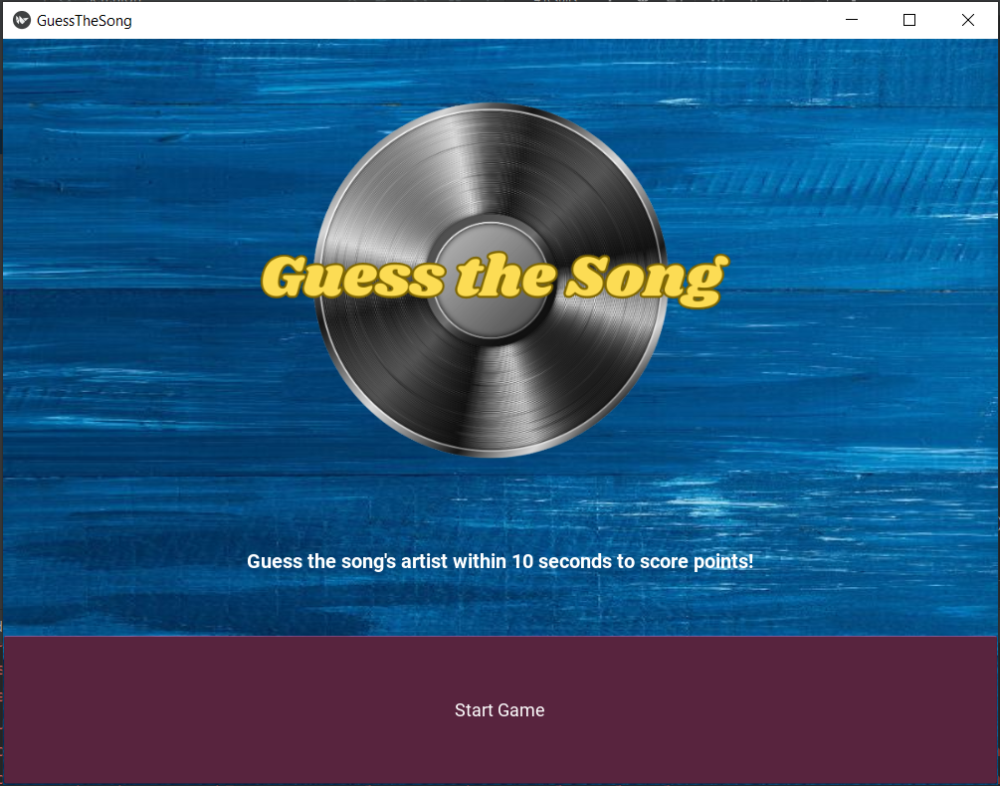
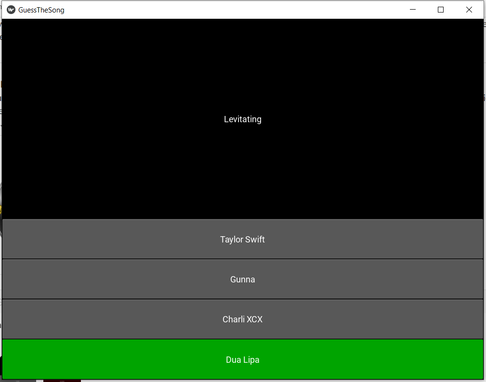
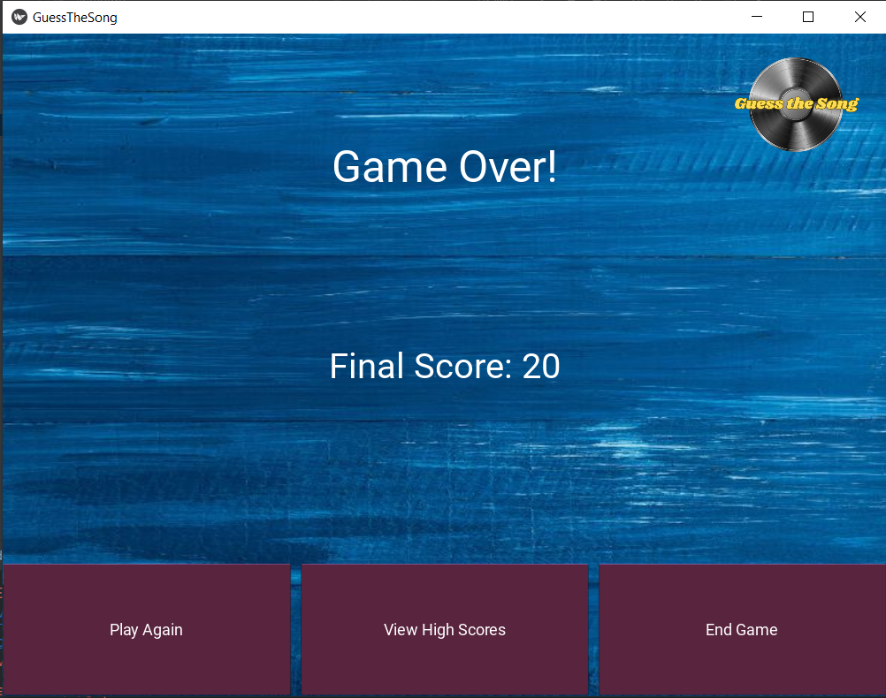
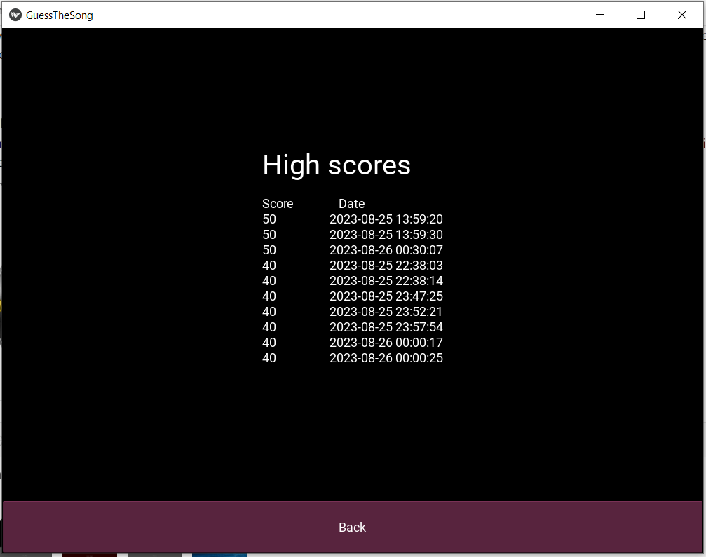

# Guess The Song

## Introduction
Guess The Song is a Python-based musical quiz game. It provides an entertaining platform for music lovers to test their knowledge and quick-thinking skills while guessing popular songs. 

## Project Objectives
- Provide an enjoyable and interactive musical quiz game that provides entertainment and challenges players to guess well-known music-related phrases.
- Produce a user-friendly and visually appealing app that enhances the gaming experience and encourages frequent play.


## Screenshots



## Demo

- [WATCH DEMO HERE](https://youtu.be/14y48_5bH9k)

## Installation
To set up and run Guess The Song, follow these steps:

1. Clone the repository to your local machine:

   ```bash
   git clone git@github.com:elizayounger29/GuessTheSongGame.git

2. Once in the directory of the cloned folder, navigate to the spotify_api.py file in the game logic folder and open. Enter your Spotify Client Id and Client Secret.

3. Navigate to the project directory:

    ```bash
    cd GuessTheSongGame

4. Install the project's dependencies using pipenv (If you do not already have pip and pipenv installed you must do so before proceeding):

    ```bash
    pipenv install
    pipenv install requests
    pipenv install spotipy
    pipenv install kivy
    pipenv install unittests

## Deployment

1. Activate the virtual environment before play

    ```bash
    pipenv shell

2. Run GuessTheSong:

    ```bash
    python main.py

## End Play

1. Once finished play, exit virtual environment:

    ```bash
    exit

## How To Play

1. Click start to proceed
2. The player will be presented with 5 short clips from hit songs 
3. Along with each clip will be displayed the song's title.
3. The player must select the song's artist, to whom they believe the songs belongs from a list of four options.
4. A correct answer is worth 10 points. The player's score will be calculated and displayed at the end of the round.

## Authors

- [@elizayounger29](https://github.com/elizayounger29)
- [@erinbyrne11](https://github.com/erinbyrne11)
- [@NCHassall](https://github.com/NCHassall)
- [@pari-pes](https://github.com/pari-pes)
- [@sarahclpower](https://github.com/sarahclpower)

## Media







